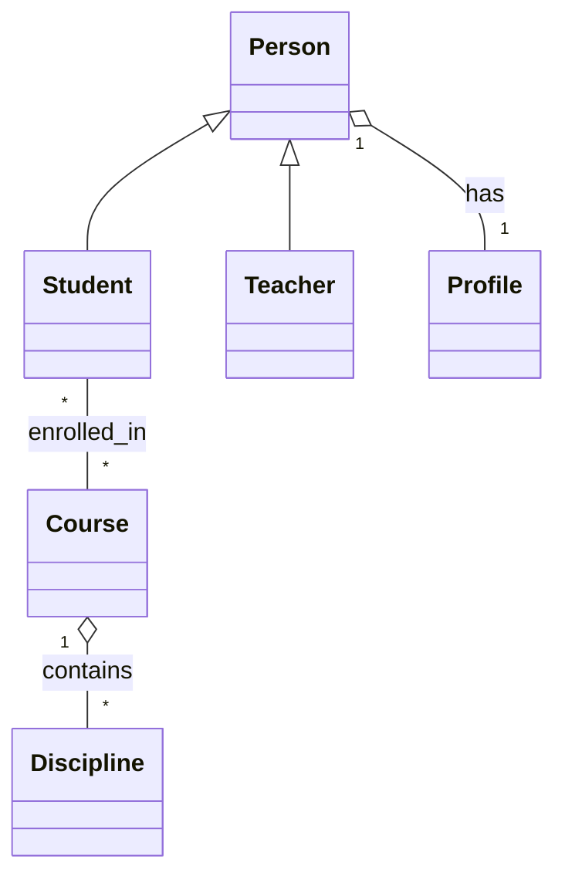

# Enem-quiz (adaptado para mapeamento JPA)

Projeto adaptado para demonstrar mapeamento Objeto-Relacional com Spring Data JPA.

## Componentes da Dupla

- Nome 1: <preencher>
- Nome 2: <preencher>

## Tema do projeto

Exemplo didático com entidades que representam pessoas, cursos e disciplinas
para demonstrar relacionamentos JPA (1:1, 1:N, N:1, N:M) e herança.

## Relacionamentos usados

- 1:1 — `Person` ↔ `Profile` (bidirecional)
- 1:N — `Course` → `Discipline` (um curso tem muitas disciplinas)
- N:1 — `Discipline` → `Course` (muitos para um)
- N:M — `Student` ↔ `Course` (alunos matriculados em vários cursos)
- Herança — `Person` (base) → `Student` e `Teacher` (estratégia: `JOINED`)

## Estratégia de herança escolhida

Usada: `InheritanceType.JOINED` — cada subclasse tem sua própria tabela, a
tabela base contém os campos comuns.

## Diagrama Mermaid



## Como rodar

1. Configure o MySQL em `src/main/resources/application.properties` (usuário/senha/database).
2. Execute:

```bash
./mvnw spring-boot:run -Dspring-boot.run.main-class=br.edu.ifpr.seuprojeto.Application
```

Isso executará a classe `br.edu.ifpr.seuprojeto.Application` que contém um
`CommandLineRunner` que insere dados de exemplo no banco (teste simples de inserção).

## O que foi adicionado

- Pacote `br.edu.ifpr.seuprojeto.model` com as entidades: `Person`, `Student`, `Teacher`, `Profile`, `Course`, `Discipline`.
- Pacote `br.edu.ifpr.seuprojeto.repository` com repositórios Spring Data JPA.
- Configuração JPA em `application.properties` (usar MySQL local).
- `CommandLineRunner` para inserir registros e criar tabelas automaticamente.

## Observações

Preencha os nomes dos componentes da dupla no topo do arquivo e ajuste o
`application.properties` para apontar ao seu banco MySQL local.

